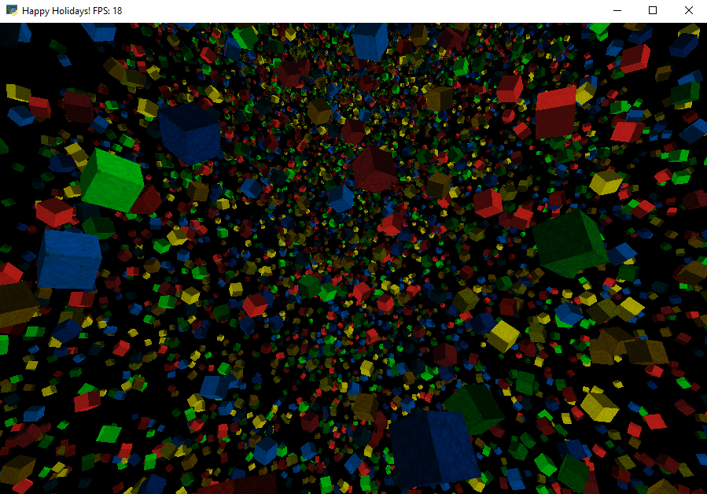

# ENGR114Exam2Project
This is a holiday edition rotating cubes simulation



## Install dependencies
```
pip install -r requirements.txt
```

## Run
```
python main.py
```

## Controls
* `c` - to toggle mouse exclusivity (makes mouse appear/disappear for optimal mouse movement)
* `wasd` - move around
* `Esc` - exit
* `Move mouse` - look around